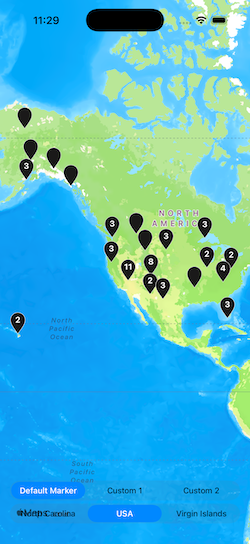
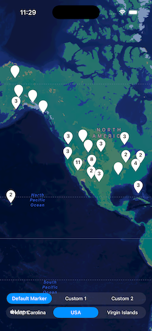
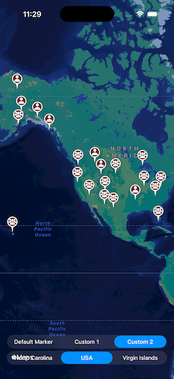
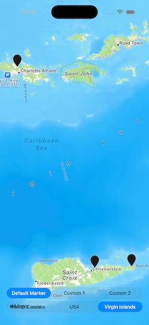
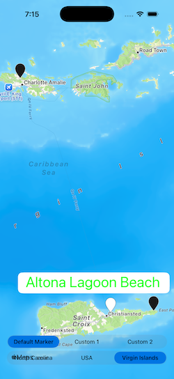
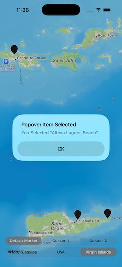

# BigJuJuMap

A Self-Contained Map With Multiple, Aggregated, Custom Markers

## Overview

This package was specifically designed to offer [`SwiftUI`](https://developer.apple.com/swiftui/) apps the opportunity to have a much more involved map experience than that provided by default.

It also allows a "drop in" high-functionality map for [`UIKit`](https://developer.apple.com/documentation/uikit/) projects.

[This is the online documentation for the library](https://littlegreenviper.github.io/BigJuJuMap/)

## How Does It Work?

The implementation is provided as a static [framework](https://developer.apple.com/documentation/xcode/creating-a-static-framework), instantiating a custom [UIViewController](https://developer.apple.com/documentation/UIKit/UIViewController) subclass ([`BigJuJuMapViewController`](https://github.com/LittleGreenViper/BigJuJuMap/blob/1547ea2d1e87f9dbb3496230d80b33f21d2747fc/Sources/BigJuJuMap/BigJuJuMap.swift#L83)).

## Usage

The library is designed to be installed as a [Swift Package Manager (SPM)](https://docs.swift.org/swiftpm/documentation/packagemanagerdocs/) package. The package is available from [GitHub](https://github.com/LittleGreenViper/BigJuJuMap). A direct SPM URI is `git@github.com:LittleGreenViper/BigJuJuMap.git`.

Add the package to your project, and include it into your target.

Whenever you use it, you will need to import it, thusly:

    import BigJuJuMap
    
You use it by instantiating [`BigJuJuMapViewController`](https://github.com/LittleGreenViper/BigJuJuMap/blob/1547ea2d1e87f9dbb3496230d80b33f21d2747fc/Sources/BigJuJuMap/BigJuJuMap.swift#L83), and providing it with a dataset (the dataset must conform to the [`BigJuJuMapLocationProtocol`](https://github.com/LittleGreenViper/BigJuJuMap/blob/1547ea2d1e87f9dbb3496230d80b33f21d2747fc/Sources/BigJuJuMap/BigJuJuMap.swift#L1452) protocol, and must be a class; not a struct).

You can also, optionally, provide the view controller with alternate marker graphic assets (the default is a simple map marker).

Additionally, you can choose to have the number of aggregated data points displayed in aggregate (multi) markers.

### Examples (The Test Harness Apps)

There are two test harness targets provided with the library: A [UIKit target](https://github.com/LittleGreenViper/BigJuJuMap/tree/master/Tests/UIKitTestHarness), and a [SwiftUI target](https://github.com/LittleGreenViper/BigJuJuMap/tree/master/Tests/SwiftUITestHarness). They show simple implementations of BigJuJuMap, in practice.

They are visually identical, presenting a single screen, filled with a map, and displaying a number of markers. At the bottom of the screen, are two segmented switches. The top switch selects which type of marker to display (default, custom simple, or custom complex), and the bottom switch selects between three different location datasets.

#### Markers

The following images show the types of markers that can be selected by the app.

The marker selection is made by changing the top segmented switch. Changing the marker does not affect the displayed region.

##### Figure 1: Default Markers

|  |  |
|:-:|:-:|
| *Light Mode* | *Dark Mode* |

##### Figure 2: Custom Markers With Space for Numbers

|  |  |
|:-:|:-:|
| *Light Mode* | *Dark Mode* |

##### Figure 3: Custom Markers With No Numbers

|  |  |
|:-:|:-:|
| *Light Mode* | *Dark Mode* |

#### Datasets

The following images show the test datasets we use.

The dataset selection is made by selecting one of the values in the bottom segmented switch. The map is changed to display the new dataset.

##### Figure 4: State Parks in North Carolina

|  |  |
|:-:|:-:|
| *Light Mode* | *Dark Mode* |

##### Figure 5: National Parks

|  |  |
|:-:|:-:|
| *Light Mode* | *Dark Mode* |

> NOTE: Because the total area for this dataset is so large, Apple Maps limits the size of the region. If you scroll West, a bit, you'll see American Samoa.

##### Figure 6: Territorial Parks in the US Virgin Islands

|  |  |
|:-:|:-:|
| *Light Mode* | *Dark Mode* |

#### Popovers

When we select a marker, a popover appears, above or below the marker.

In the case of aggregate markers, a scrolling table of values is shown.

##### Figure 7: Example of A Large Aggregate Marker

|  |  |
|:-:|:-:|
| *Light Mode* | *Dark Mode* |

For a single marker, only one value is shown.

##### Figure 8: Example of A Single Marker

|  |  |
|:-:|:-:|
| *Light Mode* | *Dark Mode* |

Note the custom font and color.

#### Reaction Alerts

When we select one of the values in a popover, the popover is dismissed, and this alert is shown:

##### Figure 9: Alert Displayed When Selecting A Row in A Popover

|  |  |
|:-:|:-:|
| *Light Mode* | *Dark Mode* |

> NOTE: In the test harness app, we display an alert, but anything can happen, when a marker is selected.

### The API

#### The View Controller

Once we have included the package into our source file, then we can simply use the Storyboard Editor to create the instance:

Or just instantiate it directly:

    self.bigJuJuMap = BigJuJuMapViewController()
    self.navigationController?.pushViewController(self.bigJuJuMap, animated: true)

#### The Map Data

Once we have the view controller ready to go, we need to give it its dataset, which is simply an array of data items that conform to [`BigJuJuMapLocationProtocol`](https://github.com/LittleGreenViper/BigJuJuMap/blob/1547ea2d1e87f9dbb3496230d80b33f21d2747fc/Sources/BigJuJuMap/BigJuJuMap.swift#L1452). The test harnesses demonstrate this with simple datasets of US national and state parks.

This is demonstrated in the [`BJJM_LocationFactory`](https://github.com/LittleGreenViper/BigJuJuMap/blob/master/Tests/Shared/Sources/BJJM_LocationFactory.swift) struct, shared between the UIKit and SwiftUI test harness apps.

Simply set the [`BigJuJuMapViewController.mapData`](https://github.com/LittleGreenViper/BigJuJuMap/blob/1547ea2d1e87f9dbb3496230d80b33f21d2747fc/Sources/BigJuJuMap/BigJuJuMap.swift#L897) property to the array, and you're good to go. You may also want to set the map's region. The BigJuJuMap package exports some helpers, to make it easy to calculate from the data array.

You can directly access the [`MKMapView`](https://developer.apple.com/documentation/mapkit/mkmapview) instance, by referencing the [`BigJuJuMapViewController.mapView`](https://github.com/LittleGreenViper/BigJuJuMap/blob/1547ea2d1e87f9dbb3496230d80b33f21d2747fc/Sources/BigJuJuMap/BigJuJuMap.swift#L960) computed property. The view controller's main [`view`](https://developer.apple.com/documentation/uikit/uiviewcontroller/view) property is also the mapView, but referenced as a top-level [UIView](https://developer.apple.com/documentation/UIKit/UIView), not [`MKMapView`](https://developer.apple.com/documentation/mapkit/mkmapview).

#### The Markers

You provide your own custom markers, by giving the [`BigJuJuMapViewController`](https://github.com/LittleGreenViper/BigJuJuMap/blob/1547ea2d1e87f9dbb3496230d80b33f21d2747fc/Sources/BigJuJuMap/BigJuJuMap.swift#L83) instance [`UIImage`](https://developer.apple.com/documentation/uikit/uiimage/)s. These will be resized, in the map, but they should have a roughly 1:2 aspect ratio. If you will choose to have [`BigJuJuMapViewController.displayNumbers`](https://github.com/LittleGreenViper/BigJuJuMap/blob/1547ea2d1e87f9dbb3496230d80b33f21d2747fc/Sources/BigJuJuMap/BigJuJuMap.swift#L925) as true (the default), then the marker images should have a large blank area in the upper portion, that will not obscure labels displayed with the [`UIColor.systembackground`]([https://developer.apple.com/documentation/uikit/uicolor/label](https://developer.apple.com/documentation/uikit/uicolor/systembackground)) color (inverse label color).

You provide the images by setting the [`BigJuJuMapViewController.singleMarkerImage`](https://github.com/LittleGreenViper/BigJuJuMap/blob/1547ea2d1e87f9dbb3496230d80b33f21d2747fc/Sources/BigJuJuMap/BigJuJuMap.swift#L905) and [`BigJuJuMapViewController.multiMarkerImage`](https://github.com/LittleGreenViper/BigJuJuMap/blob/1547ea2d1e87f9dbb3496230d80b33f21d2747fc/Sources/BigJuJuMap/BigJuJuMap.swift#L915) properties. Leaving them as nil, will cause the built-in (upside-down teardrop) marker to be used.

> NOTE: If you want the same image to be used for both ("Custom 1," in the test harness apps), then you need to provide the same image to **BOTH** of the properties.

#### Additional Settings

You can specify a font and color to be used, in data items. If these are present, the text in the popover for that item will be displayed with the color and font provided. Otherwise, the standard button font and color will be used.

You can set [`displayNumbers`](https://github.com/LittleGreenViper/BigJuJuMap/blob/1547ea2d1e87f9dbb3496230d80b33f21d2747fc/Sources/BigJuJuMap/BigJuJuMap.swift#L925) to false, and the numbers for aggregate markers will not display (for example, if you have intricate custom markers, the numbers will interfere).

You can set [`stickyPopups`](https://github.com/LittleGreenViper/BigJuJuMap/blob/1547ea2d1e87f9dbb3496230d80b33f21d2747fc/Sources/BigJuJuMap/BigJuJuMap.swift#L935) to true, and the popovers will not dismiss, when an item is selected.

## Usage in SwiftUI

SwiftUI has a very limited support for MapKit, which was why this package was written. In order to use it in SwiftUI, you need to wrap it in a [`UIViewControllerRepresentable`](https://developer.apple.com/documentation/swiftui/uiviewcontrollerrepresentable/) instance. This is demonstrated in the SwiftUI test harness, in the 
[`BJJM_BigJuJuMapViewController`](https://github.com/LittleGreenViper/BigJuJuMap/blob/1547ea2d1e87f9dbb3496230d80b33f21d2747fc/Tests/SwiftUITestHarness/BJJM_SwiftUIMainView.swift#L27) struct.

## License

    MIT License
     
    Permission is hereby granted, free of charge, to any person obtaining a copy
    of this software and associated documentation files (the "Software"), to deal
    in the Software without restriction, including without limitation the rights
    to use, copy, modify, merge, publish, distribute, sublicense, and/or sell
    copies of the Software, and to permit persons to whom the Software is
    furnished to do so, subject to the following conditions:
    
    The above copyright notice and this permission notice shall be included in all
    copies or substantial portions of the Software.
    
    THE SOFTWARE IS PROVIDED "AS IS", WITHOUT WARRANTY OF ANY KIND, EXPRESS OR
    IMPLIED, INCLUDING BUT NOT LIMITED TO THE WARRANTIES OF MERCHANTABILITY,
    FITNESS FOR A PARTICULAR PURPOSE AND NONINFRINGEMENT. IN NO EVENT SHALL THE
    AUTHORS OR COPYRIGHT HOLDERS BE LIABLE FOR ANY CLAIM, DAMAGES OR OTHER
    LIABILITY, WHETHER IN AN ACTION OF CONTRACT, TORT OR OTHERWISE, ARISING FROM,
    OUT OF OR IN CONNECTION WITH THE SOFTWARE OR THE USE OR OTHER DEALINGS IN THE
    SOFTWARE.
